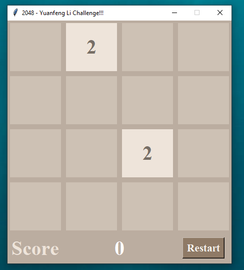
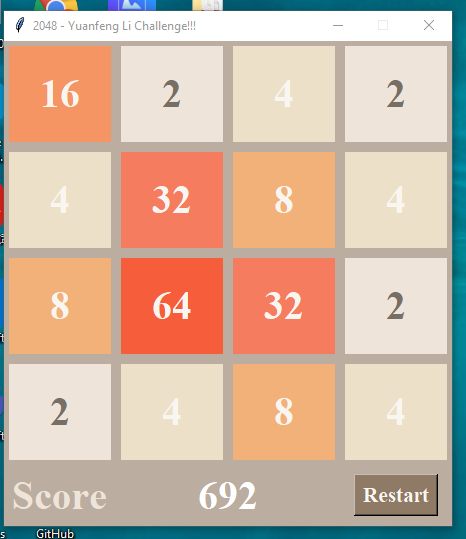
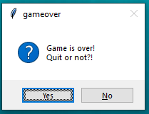

# 2048 game algorithm and GUI
# About:
This small games gives you the same game experience with 2048, the algorithm is not the best, but it is a good way to practice and have fun with.
- Feel free to leave your thoughts and comments.
- the website of original game: http://2048game.com/

## Requirement to play:
- Python version: 
    * Since there are small difference between python 2 & python 3, this program will only works with python 3, make sure to install it before lunching it.
    * Tkinter - you have to install this before you run it on linux systems.
- OS: 
    * Windows 10
    * Linux

## How it looks like:
1. when you open this, it should looked like this:

2. when the game over like this, in which you can not make anymovement it will be like this:

3. when the game is over, there will be a small messagebox asking whether you want to quit or not. (choose carefully)

## How to play:
- if you have WIN 10, then just download it and make sure you use python3 version to run it. 
- same in linux system.

